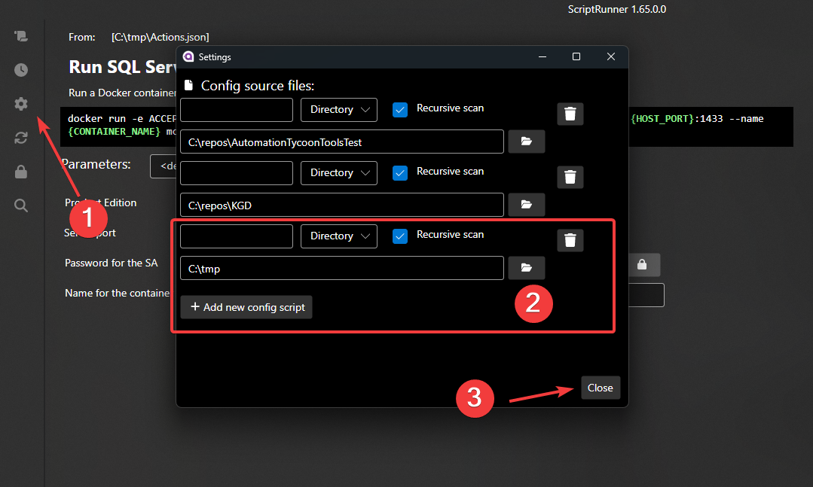
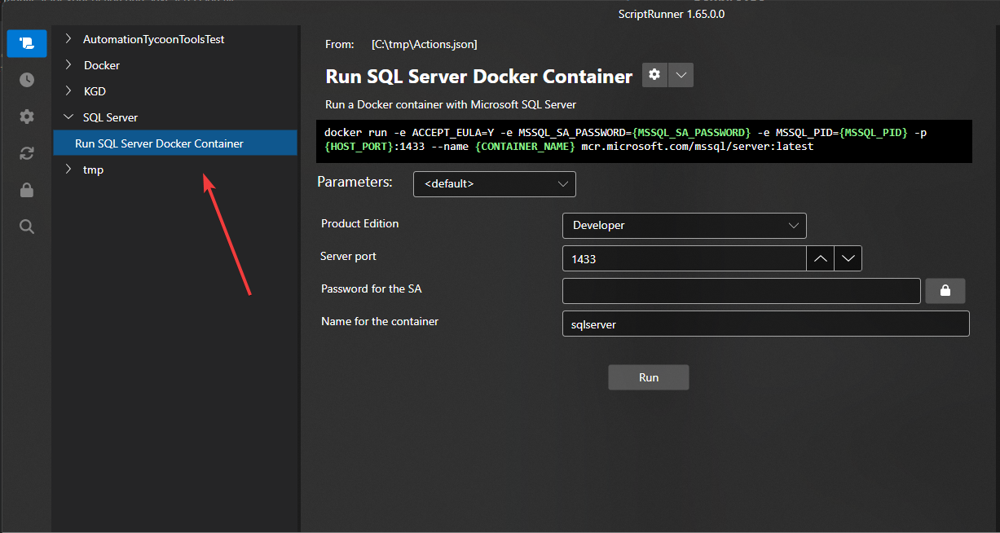

# ScriptRunner - Create a simple UI for your favorite scripts and command line tools without any coding.


## Overview

ScriptRunner is a UI application designed to act as a shell for any command line program or script. The main idea behind ScriptRunner is to allow users to define actions in a JSON file, specifying the parameters for the programs/scripts. ScriptRunner automatically generates a UI form for entering these parameters, making it easy to run the desired script. This document provides a complete guide to using ScriptRunner, including the structure of the manifest file, an example, and a detailed explanation of its components.

## Key features

- ✅ Provides an easy-to-use interface for CLI tools and scripts
- ✅ Compatible with any scripting language (PowerShell, Bash, Python, etc.)
- ✅ Fully cross-platform (Windows, Linux, MacOS)
- ✅ Securely manage passwords and API keys required by scripts
- ✅ Provides notifications for updates to scripts shared via Git repositories
- ✅ Allows creation of predefined parameter sets to streamline common use cases
- ✅ Supports pre-defined responses for interactive script prompts
- ✅ Includes troubleshooting messages for common script problems
- ✅ Allows you to define installation processes for script dependencies
- ✅ Maintains an execution history log, allowing reuse of parameters from previous runs
- ✅ Provides an intuitive browsing experience for your script library (tags, search, etc.)

  
## How to install

ScriptRunner is built with dotnet core and AvaloniUI, which makes it fully cross-platform. The only required prerequisite is the presence of dotnet SDK 6.0+, which can be downloaded from here https://dotnet.microsoft.com/en-us/download/dotnet
If you already have dotnet sdk, you can install ScriptRunner on any platform with the following command:


```shell
dotnet tool install --global ScriptRunnerGUI --no-cache --ignore-failed-sources --add-source https://api.nuget.org/v3/index.json
```

After successful installation, simply type `ScriptRunnerGUI` in the console to run it. On Windows, you can pin the ScriptRunner icon to your taskbar for easy access.


### How to use it

Prepare a manifest for your action and save it as a json file. The recommended way is to use an editor like VSCode and include the schema reference available at:
[ScriptRunnerSchema.json](https://raw.githubusercontent.com/cezarypiatek/ScriptRunnerPOC/main/schema/v1/ScriptRunnerSchema.json) Thanks to the power of VSCode and JSON schema, you will get intellisense and semantic validation.
A sample manifest that allows to run docker container can look as follows:


```json
{
    "$schema": "https://raw.githubusercontent.com/cezarypiatek/ScriptRunnerPOC/main/schema/v1/ScriptRunnerSchema.json",
    "actions": [
        {
            "name": "SqlServerDocker",
            "description": "Run a Docker container with Microsoft SQL Server",
            "command": "docker run -e ACCEPT_EULA=Y -e MSSQL_SA_PASSWORD={MSSQL_SA_PASSWORD} -e MSSQL_PID={MSSQL_PID} -p {HOST_PORT}:1433 --name {CONTAINER_NAME} mcr.microsoft.com/mssql/server:latest",
            "installCommand": "docker pull mcr.microsoft.com/mssql/server:latest",
            "categories": ["Docker", "SQL Server"],
            "params": [
                {
                    "name": "MSSQL_PID",
                    "prompt": "dropdown",
                    "description": "Product Edition",
                    "default": "Developer",
                    "promptSettings": {
                        "options": "Developer,Express,Standard,Enterprise"
                    }
                },
                {
                    "name": "HOST_PORT",
                    "prompt": "numeric",
                    "description": "Server port",
                    "default": "1433"
                },
                {
                    "name": "MSSQL_SA_PASSWORD",
                    "prompt": "password",
                    "description": "Password for the SA"
                },
                {
                    "name": "CONTAINER_NAME",
                    "prompt": "text",
                    "description": "Name for the container",
                    "default": "sqlserver"
                }
            ]
        }
    ]
}

```
Add a file or directory with your action manifest to `Action Sources`




Using script list locate your action




## Components of the Manifest File

### `$schema`

This field points to the JSON schema that validates the manifest file. It ensures that the file adheres to the required structure and formats and provides intellisense in editors like VSCode.

### `actions`

This is an array of action objects. Each action defines a specific script or command-line program that the UI will execute.

### Action Object

Each action object has the following properties:

- `name`: A unique name for the action.
- `description`: A brief description of what the action does.
- `command`: The command or script to be executed. A command can contains placeholders in curly brackets that should match names from `params` section.
- `installCommand`: (Optional) A command to install necessary dependencies for the script.
- `categories`: An array of categories to which this action belongs.
- `autoParameterBuilderStyle`: Specifies the style for automatic parameter generation (e.g., `powershell`).
- `params`: An array of parameter objects that define the inputs required by the command.

## Parameters

Each parameter object has the following properties:

- `name`: The name of the parameter.
- `prompt`: The type of prompt (e.g., `numeric`, `datePicker`, `filePicker`, `text`).
- `promptSettings`: (Optional) Additional settings for the prompt (e.g., date format, culture).
- `description`: (Optional) A description of the parameter.
- `default`: (Optional) A default value for the parameter.

### Prompt Types

## text

A single line text input.

### Prompt Settings
- **minLength** (integer): Minimum length of the text.
- **maxLength** (integer): Maximum length of the text.


## multilineText

A multi-line text input.

### Prompt Settings
- **minLines** (integer): Minimum number of lines.
- **maxLines** (integer): Maximum number of lines.


## password

A password input.

### Prompt Settings
- **minLength** (integer): Minimum length of the password.
- **maxLength** (integer): Maximum length of the password.


## checkbox

A checkbox input.
### Prompt Settings
- **checkedValue** (string): Value when checkbox checked.
- **uncheckedValue** (string): Value when checkbox unchecked.


## dropdown

A dropdown selection input.
### Prompt Settings
- **options** (string): Comma separated list of values.


## multiSelect

A multi-select input.

### Prompt Settings
- **options** (string): Comma separated list of values.
- **delimiter** (string): Delimiter for merging selected values.

## filePicker

A file picker input.

## directoryPicker

A directory picker input.


## fileContent

A file content input. An input content will be save to temporary dir and pass as a file path to executed action.


## datePicker
**Type**: object

A date picker input.

### Prompt Settings
- **format**  (string)
- **yearVisible** (boolean)
- **monthVisible** (boolean)
- **dayVisible** (boolean)
- **todayAsDefault** (boolean)
- **culture** (string)


## numeric

A numeric input.

### Prompt Settings
- **min** (number): Minimum value.
- **max** (number): Maximum value.
- **step** (number): Step value.


## timePicker

A time picker input.

### Prompt Settings
- **format** (string): Time format (e.g., HH:mm).


## Generate action definition from `PowerShell` script

```pwsh
function Get-ActionDefinition
{
  param($CommandPath)
  
  $data = Get-Command $CommandPath
  
   [Ordered]@{
    name = [regex]::Replace($data.Name.TrimEnd(".ps1"), "(\p{Ll})(\p{Lu})", '$1 $2')
    command = "pwsh -NoProfile -Command "+ $(Resolve-Path $CommandPath -Relative)
    autoParameterBuilderStyle = "powershell"
    params = foreach($key in  $data.Parameters.Keys)
    {
      [Ordered]@{
        name = $key
        description  = [regex]::Replace($key, "(\p{Ll})(\p{Lu})", '$1 $2')
        prompt = if($data.Parameters[$key].SwitchParameter)
                {
                  "checkbox" 
                }
                elseif($data.Parameters[$key].ParameterType.Name -eq "DateTime")
                {
                  "datePicker"
                }
                elseif($key -match "path")
                {
                  "filePicker"
                }
                else{
                  "text"
                }
      }
    }
  } | ConvertTo-Json -Depth 10
}
```
