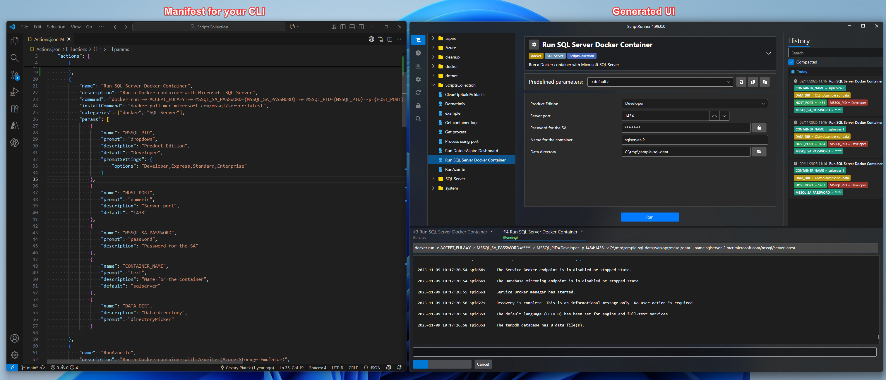
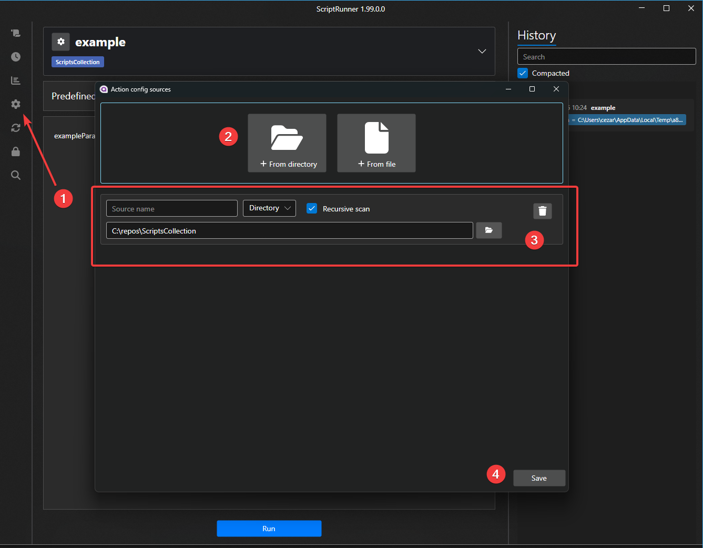
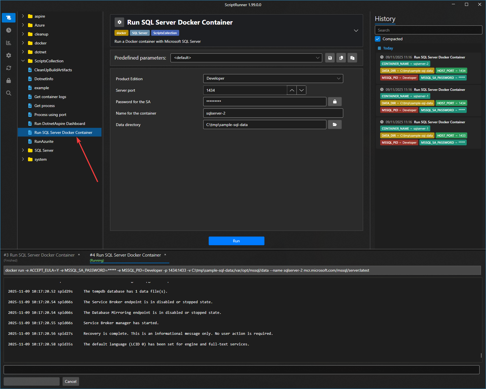
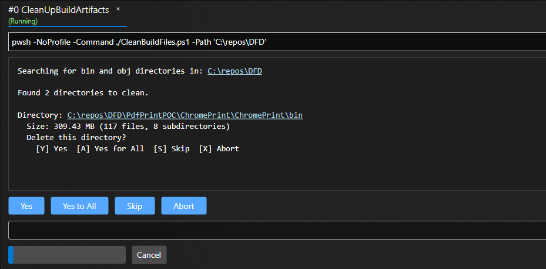

# ScriptRunner - Create a simple UI for your favorite scripts and command line tools without any coding.




## Overview

ScriptRunner is a UI application designed to act as a shell for any command line program or script. The main idea behind ScriptRunner is to allow users to define actions in a JSON file, specifying the parameters for the programs/scripts. ScriptRunner automatically generates a UI form for entering these parameters, making it easy to run the desired script. This document provides a complete guide to using ScriptRunner, including the structure of the manifest file, an example, and a detailed explanation of its components.

## Table of contents

- [Key features](#key-features)
- [How to install](#how-to-install)
- [How to use it](#how-to-use-it)
- [Ready-to-run examples](#ready-to-run-examples)
  - [PowerShell hello prompt](#powershell-hello-prompt)
  - [Python hello prompt](#python-hello-prompt)
  - [WSL Bash hello prompt](#wsl-bash-hello-prompt)
  - [.NET hello prompt](#net-hello-prompt)
- [Schema](#schema)
- [Predefined argument sets](#predefined-argument-sets)
- [Interactive inputs](#interactive-inputs)
- [Troubleshooting alerts](#troubleshooting-alerts)
- [Generate action definition from `PowerShell` script](#generate-action-definition-from-powershell-script)

## Key features

- ✅ Provides an easy-to-use interface for CLI tools and scripts
- ✅ Compatible with any scripting language (PowerShell, Bash, Python, etc.)
- ✅ Fully cross-platform (Windows, Linux, MacOS)
- ✅ Securely manage passwords and API keys required by scripts
- ✅ Provides notifications for updates to scripts shared via Git repositories
- ✅ Allows creation of predefined parameter sets to streamline common use cases
- ✅ Supports pre-defined responses for interactive script prompts
- ✅ Includes troubleshooting messages for common script problems
- ✅ Allows you to define installation processes for script dependencies
- ✅ Maintains an execution history log, allowing reuse of parameters from previous runs
- ✅ Provides an intuitive browsing experience for your script library (tags, search, etc.)
- ✅ Displays markdown documentation for your scripts

  
## How to install

ScriptRunner is built with dotnet core and AvaloniUI, which makes it fully cross-platform. The only required prerequisite is the presence of dotnet SDK 6.0+, which can be downloaded from here https://dotnet.microsoft.com/en-us/download/dotnet
If you already have dotnet sdk, you can install ScriptRunner on any platform with the following command:


```shell
dotnet tool install --global ScriptRunnerGUI --no-cache --ignore-failed-sources --add-source https://api.nuget.org/v3/index.json
```

After successful installation, simply type `ScriptRunnerGUI` in the console to run it. On Windows, you can pin the ScriptRunner icon to your taskbar for easy access.


## How to use it

Prepare a manifest for your action and save it as a json file. The recommended way is to use an editor like VSCode and include the schema reference available at:
[ScriptRunnerSchema.json](https://raw.githubusercontent.com/cezarypiatek/ScriptRunnerPOC/main/schema/v1/ScriptRunnerSchema.json) Thanks to the power of VSCode and JSON schema, you will get intellisense and semantic validation.
A sample manifest that allows to run docker container can look as follows:


```json
{
    "$schema": "https://raw.githubusercontent.com/cezarypiatek/ScriptRunnerPOC/main/schema/v1/ScriptRunnerSchema.json",
    "actions": [
       {
            "name": "Run SQL Server Docker Container",
            "description": "Run a Docker container with Microsoft SQL Server",
            "command": "docker run -e ACCEPT_EULA=Y -e MSSQL_SA_PASSWORD={MSSQL_SA_PASSWORD} -e MSSQL_PID={MSSQL_PID} -p {HOST_PORT}:1433 -v {DATA_DIR}:/var/opt/mssql/data --name {CONTAINER_NAME} mcr.microsoft.com/mssql/server:latest",
            "installCommand": "docker pull mcr.microsoft.com/mssql/server:latest",
            "categories": ["docker", "SQL Server"],
            "params": [
                {
                    "name": "MSSQL_PID",
                    "prompt": "dropdown",
                    "description": "Product Edition",
                    "default": "Developer",
                    "promptSettings": {
                        "options": ["Developer", "Express", "Standard", "Enterprise"]
                    }
                },
                {
                    "name": "HOST_PORT",
                    "prompt": "numeric",
                    "description": "Server port",
                    "default": "1433"
                },
                {
                    "name": "MSSQL_SA_PASSWORD",
                    "prompt": "password",
                    "description": "Password for the SA"
                },
                {
                    "name": "CONTAINER_NAME",
                    "prompt": "text",
                    "description": "Name for the container",
                    "default": "sqlserver"
                },
                {
                    "name": "DATA_DIR",
                    "description": "Data directory",
                    "prompt": "directoryPicker"
                }
            ]
        }
    ]
}

```
Add a file or directory with your action manifest to `Action Sources`




Using script list locate your action




## Components of the Manifest File

### `$schema`

This field points to the JSON schema that validates the manifest file. It ensures that the file adheres to the required structure and formats and provides intellisense in editors like VSCode. Should be set to `https://raw.githubusercontent.com/cezarypiatek/ScriptRunnerPOC/main/schema/v1/ScriptRunnerSchema.json`

### `actions`

This is an array of action objects. Each action defines a specific script or command-line program that the UI will execute. 

## Action Object

Each action object describes how a single automation should be rendered and executed:

- `name` / `description`: Title and subtitle shown in ScriptRunner (names must be unique per source).
- `command` *(required)*: CLI command template. Use `{paramName}` placeholders for parameter values. Relative paths are resolved against the JSON file.
- `useSystemShell`: Launches command via the OS shell instead of embedded console.
- `runCommandAsAdmin`: Blocks execution unless ScriptRunner is running elevated (Windows) or `sudo` capable.
- `workingDirectory`: Overrides the default (folder that contains the manifest) for the main command.
- `installCommand`, `installCommandWorkingDirectory`, `runInstallCommandAsAdmin`: Optional setup command shown as “Install”.
- `categories`: Labels used to group/search actions in the UI.
- `docs`: Path to a markdown file displayed alongside the action.
- `environmentVariables`: Key/value map (values can embed `{paramName}` placeholders) injected into the spawned process.
- `autoParameterBuilderStyle` / `autoParameterBuilderPattern`: Configure how parameters are appended to the command automatically.
- `predefinedArgumentSets` + optional `predefinedArgumentSetsOrdering`: Named presets that pre-fill parameter values (ScriptRunner always adds a `<default>` set, but you can add more).
- `params`: Array of parameter definitions (see the next section).
- `interactiveInputs`: Map console output patterns to quick-reply buttons that feed text back to STDIN.
- `troubleshooting` / `installTroubleshooting`: Regex-driven alerts displayed when the main or install command writes matching output.


## Parameters

Each parameter object can shape both the UI control and how ScriptRunner constructs the final command. The most common properties are:

- `name` *(required)*: Identifier used for placeholders (`{name}`), predefined argument sets, and environment-variable substitutions.
- `description`: Text shown next to the control; falls back to `name` when omitted.
- `default`: Value pre-populated in the UI and stored in the automatically generated `<default>` argument set.
- `prompt` *(required)*: Chooses the control type (text box, dropdown, checkbox, etc.). See [Prompt Types](docs/PromptTypes.md).
- `promptSettings`: Control-specific settings (date format, dropdown options, file template, etc.).
- `autoParameterBuilderPattern`: Overrides the action-level pattern when auto-appending this parameter to the command.
- `valueGeneratorCommand`: Optional helper command that runs on demand and fills the control with its stdout (relative paths are resolved from the action file).
- `valueGeneratorLabel`: Custom tooltip/label for the auto-fill button triggered by `valueGeneratorCommand`.
- `skipFromAutoParameterBuilder`: When `true`, excludes the parameter from `auto parameter builder` (useful when parameter is used only in `value generators` of other parameters).

### Prompt Types

The `prompt` property determines which control ScriptRunner renders for a parameter (text box, dropdown, checkbox, file picker, etc.) and which `promptSettings` are available. For the full catalog of controls, supported settings, and sample JSON snippets, see the dedicated [Prompt Types guide](docs/PromptTypes.md).


## Environment variables

`environmentVariables` lets you set additional process variables without touching the global shell. Values support `{paramName}` substitution, so you can easily reference values of other parameters:

```json
"environmentVariables": {
  "AWS_PROFILE": "{profile}",
  "VAULT_TOKEN": "{vaultToken}"
}
```

## Markdown docs

Add `docs: "path/to/file.md"` to show instructions, diagrams, or runbooks next to the action. ScriptRunner resolves the path relative to the manifest and automatically loads referenced assets (images, attachments) from the same folder.

## Auto parameter builder

If most of your commands follow a pattern how parameters are passed to executed action, set one of the builders instead of concatenating strings manually:

```json
"autoParameterBuilderStyle": "powershell"
```

The PowerShell builder emits `-ParamName 'Value'` for every parameter unless `skipFromAutoParameterBuilder` is true. For other CLIs you can provide a custom template:

```json
"autoParameterBuilderPattern": "--{name} \"{{{name}}}\""
```

You can still override the pattern per parameter via `autoParameterBuilderPattern`.

## Predefined argument sets

Bundle common parameter combinations into named presets so teammates can run frequent scenarios with one click:

```json
"predefinedArgumentSets": [
  {
    "description": "Production",
    "fallbackToDefault": true,
    "arguments": {
      "subscription": "prod-sub",
      "resourceGroup": "rg-prod-shared"
    }
  }
],
"predefinedArgumentSetsOrdering": "Descending"
```

`fallbackToDefault` fills in any missing parameters from the automatically generated `<default>` set.

## Ready-to-run examples

The repository ships with `examples/ScriptRunnerExamples.json`, a manifest that contains four minimal actions showcasing how to wrap PowerShell, Python, Bash (via WSL), and .NET console apps. Import that file from **Settings ➜ Config sources** and you will get the following definitions (interactive inputs and troubleshooting rules are omitted here for brevity):

### PowerShell hello prompt

```json
{
  "name": "PowerShell Hello Prompt",
  "description": "Demonstrates stdin buttons and troubleshooting with a PowerShell script.",
  "command": "pwsh -NoProfile -Command ./examples/powershell/HelloPrompt.ps1",
  "autoParameterBuilderStyle": "powershell",
  "categories": ["powershell"],
  "params": [
    {
      "name": "textArgument",
      "description": "Text value passed to the script",
      "default": "ScriptRunner",
      "prompt": "text"
    },
    {
      "name": "filePath",
      "description": "File whose content can be displayed",
      "default": "./examples/sample-data/hello.txt",
      "prompt": "filePicker"
    }
  ]
}
```

### Python hello prompt

```json
{
  "name": "Python Hello Prompt",
  "description": "Same scenario implemented in Python.",
  "command": "python -u ./examples/python/hello_prompt.py \"{textArgument}\" \"{filePath}\"",
  "categories": ["python"],
  "params": [
    {
      "name": "textArgument",
      "description": "Text value passed to the script",
      "default": "ScriptRunner",
      "prompt": "text"
    },
    {
      "name": "filePath",
      "description": "File whose content can be displayed",
      "default": "./examples/sample-data/hello.txt",
      "prompt": "filePicker"
    }
  ]
}
```

### WSL Bash hello prompt

```json
{
  "name": "WSL Bash Hello Prompt",
  "description": "Runs the Bash implementation inside WSL",
  "command": "wsl -e sh ./bash/hello_prompt.sh \"{textArgument}\" \"{filePath}\"",
  "categories": ["bash", "wsl"],
  "params": [
    {
      "name": "textArgument",
      "description": "Text value passed to the script",
      "default": "ScriptRunner",
      "prompt": "text"
    },
    {
      "name": "filePath",
      "description": "File whose content can be displayed",
      "default": "./examples/sample-data/hello.txt",
      "prompt": "filePicker",
      "promptSettings": {
        "useWslPathFormat": true
      }
    }
  ]
}
```

### .NET hello prompt

```json
{
  "name": "C# Hello Prompt",
  "description": "Uses dotnet run on the HelloPromptApp console project.",
  "command": "dotnet run --project ./examples/dotnet/HelloPromptApp/HelloPromptApp.csproj -- \"{textArgument}\" \"{filePath}\"",
  "categories": ["dotnet"],
  "params": [
    {
      "name": "textArgument",
      "description": "Text value passed to the app",
      "default": "ScriptRunner",
      "prompt": "text"
    },
    {
      "name": "filePath",
      "description": "File whose content can be displayed",
      "default": "./examples/sample-data/hello.txt",
      "prompt": "filePicker"
    }
  ]
}
```

## Interactive inputs

Interactive inputs let you display predefined buttons with replies whenever the running script prints a prompt you recognize. Each entry consists of:

- `whenMatched`: Regex evaluated against live STDOUT (ANSI codes are stripped automatically).
- `inputs`: A list of `{ label, value }` pairs rendered as buttons; clicking a button writes `value` to the process STDIN, so you can automate those “Type YES” confirmations.

Example:

```json
 "interactiveInputs": [
  {
      "whenMatched": "Delete this directory?",
      "inputs": [
          {
              "label": "Yes",
              "value": "Y"
          },
          {
              "label": "Yes to All",
              "value": "A"
          },
          {
              "label": "Skip",
              "value": "S"
          },
          {
              "label": "Abort",
              "value": "X"
          }
      ]
  }
]
```

Whenever the command prints “Delete this directory?”, ScriptRunner shows extra buttons representing predefined responses. After pressing selected button, corresponding value followed by a newline is sent to the process.




## Troubleshooting alerts

`troubleshooting` (and `installTroubleshooting` for the install command) let you transform noisy logs into actionable hints. Each rule has:

- `whenMatched`: Regex that runs against sanitized STDOUT/STDERR.
- `alertMessage`: Text displayed in the UI (supports `${namedGroup}` replacements from the regex).
- `severity`: One of `error`, `warning`, `info`, `success` which controls styling.

Example:

```json
"troubleshooting": [
  {
    "whenMatched": "Missing secret (?<name>\\w+)",
    "alertMessage": "Secret ${name} is missing. Open the vault and add it.",
    "severity": "warning"
  }
]
```

When the output contains `Missing secret API_TOKEN`, ScriptRunner raises a yellow banner with the message above, helping teammates recover faster. Pair these alerts with markdown docs for a more guided troubleshooting flow.


## Generate action definition from `PowerShell` script

```pwsh
function Get-ActionDefinition
{
  param($CommandPath)
  
  $data = Get-Command $CommandPath
  
   [Ordered]@{
    name = [regex]::Replace($data.Name.TrimEnd(".ps1"), "(\p{Ll})(\p{Lu})", '$1 $2')
    command = "pwsh -NoProfile -Command "+ $(Resolve-Path $CommandPath -Relative)
    autoParameterBuilderStyle = "powershell"
    params = foreach($key in  $data.Parameters.Keys)
    {
      [Ordered]@{
        name = $key
        description  = [regex]::Replace($key, "(\p{Ll})(\p{Lu})", '$1 $2')
        prompt = if($data.Parameters[$key].SwitchParameter)
                {
                  "checkbox" 
                }
                elseif($data.Parameters[$key].ParameterType.Name -eq "DateTime")
                {
                  "datePicker"
                }
                elseif($key -match "path")
                {
                  "filePicker"
                }
                else{
                  "text"
                }
      }
    }
  } | ConvertTo-Json -Depth 10
}
```
